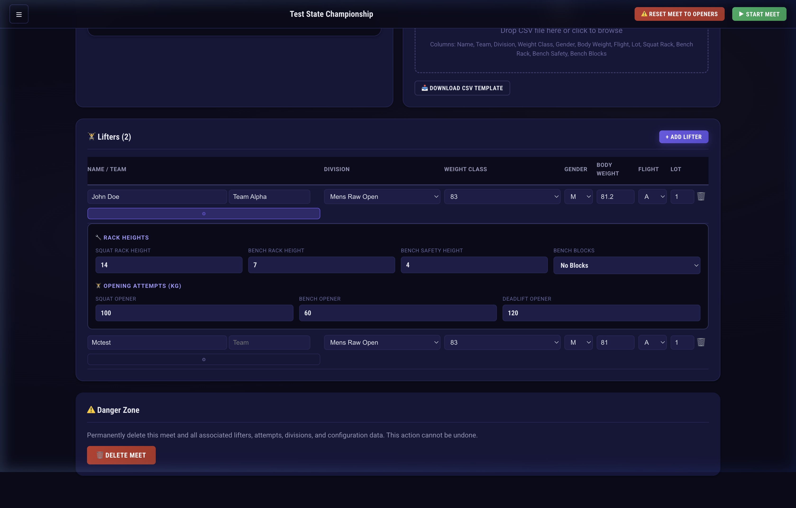
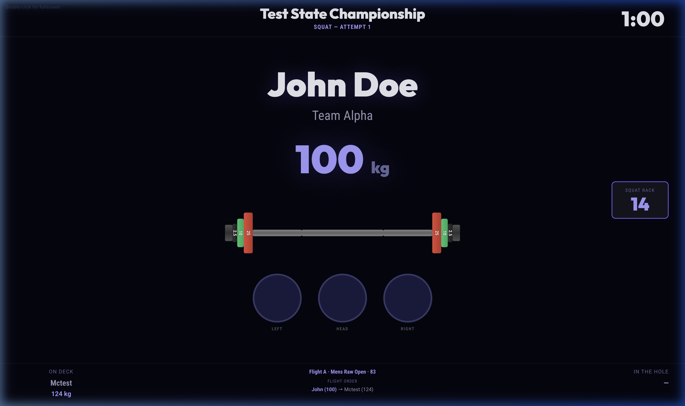
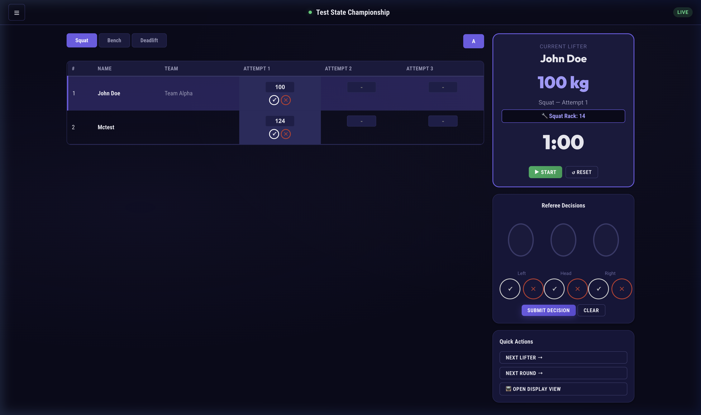

# Sway - Powerlifting Meet Management App (v3.0.0)

Sway is a minimal, local-first web application designed to help you run powerlifting meets straight from your laptop. It connects devices over your local network to provide real-time scoreboards, referee light systems, and TV display views.


| **Setup View** | **TV Display Board** | **Live Run Board** |
|:---:|:---:|:---:|
|  |  |  |
| *Lifter Management & Rack Heights* | *Animated Plate Loader & Timer* | *Operator Dashboard & Scoring* |


## Features

- **Local Network Sync**: Run the server on your laptop and access referee, display, and scoring views from phones, tablets, or TVs connected to the same Wi-Fi. No internet required.
- **TV Display Mode**: HDMI-optimized full-screen view with a real-time plate loader visualization, current lifter info, and large referee lights.
- **Dynamic Units (KG/LB)**: Full support for both metric and imperial meets. Toggling units automatically updates all displays, plate loaders, and results in real-time.
- **Referee System**: Mobile-friendly referee pages for the Left, Head, and Right judges to cast white/red lights. The system auto-calculates the final result based on majority vote.
- **Meet Configuration**: Built-in division presets for USAPL, USPA, and IPF. Add custom divisions, weight classes, and easily import lifters via CSV.
- **Live Scoring Board**: Operator dashboard showing lifting order, flight tracking, and a 60-second competition timer.
- **Automated Results & DOTS**: Real-time results page showing placing, totals, and color-coded attempt tables. 100% accurate DOTS points calculation for relative strength, with full unit-support.
- **Rock Solid Integrity**: Integrated server-side broadcasting for real-time sync, input validation for body weights and attempt weights, and automated majority-vote calculation.

## Getting Started

You do not need an active internet connection to run the meet, but you must have Node.js installed on the host machine.

### Option 1: Run with Node.js (Recommended for Local Use)

1. Clone the repository and navigate to the project directory:
   ```bash
   git clone https://github.com/SkiLov3/sway.git
   cd sway
   ```
2. Install dependencies (including development dependencies for testing):
   ```bash
   npm install
   ```
3. Start the server:
   ```bash
   npm start
   ```

4. Open `http://localhost:3000` in your browser.

The app will display your local network IP (e.g., `http://192.168.1.100:3000`) so you can access the referee and display pages from other devices on your Wi-Fi.

## Testing

Sway includes a comprehensive test suite using **Jest** and **Supertest** to ensure scoring accuracy and API reliability.

### Run all tests:
```bash
npm test
```

### Test Coverage:
- **Scoring Logic**: Validates DOTS points calculation for men, women, and non-binary lifters.
- **Meets API**: Ensures meet creation, updates, and state management work as expected.
- **Lifters API**: Verifies lifter registration, input validation, and CSV import logic.
- **Attempts API**: Tests real-time weight setting, referee voting, and majority-rule results.

## How to Run a Meet

Sway is designed for a seamless meet-day flow. Follow these steps to set up and execute your competition:

### 1. Initial Setup
- **Create Your Meet**: On the home screen, click "Create Meet." Set the name, date, federation, and units (KG or LBS).
- **Configure Divisions**: Enter the "Setup" view for your meet. Add divisions and weight classes manually or use the built-in presets (USAPL, USPA, etc.).
- **Import Lifters**: Use the "Import CSV" feature to bulk-add lifters. Ensure your CSV matches the template (available for download in the Setup view).
- **Assign Rack Heights**: Input rack heights and safety settings for each lifter in the Setup view so they appear on the TV display during the meet.

### 2. Meet Execution (The "Run Board")
The **Run Meet** view is the command center for the meet director:
- **Lifting Order**: Sway automatically sorts lifters by attempt weight and lot number (the standard powerlifting order).
- **Managing Attempts**: Enter attempt weights as lifters call them. Click a lifter to select them as the "Active" lifter.
- **Referee Decisions**: As referees cast votes from their devices, the lights on the Run Board and TV Display will update in real-time. The director can also manually input decisions from the board.
- **Auto-Progression**: When a decision is finalized (Good/No Lift), Sway will automatically move the TV display to the next lifter after a short delay (default 15s). The Run board will visually advance once the TV banner clears.
- **Flight & Round Transitions**: Use the "Next Round" quick action to move from Attempt 1 to Attempt 2, or to transition between flights (e.g., Flight A to Flight B).

### 3. Display & Referee Setup
- **TV Display**: Connect a laptop to a TV via HDMI and open the **Display View** in full-screen. It shows the current lifter, animated plate loader, competition timer, and referee lights.
- **Referee Panels**: Referees can open the **Referee View** on their phones by navigating to the server's local IP. They select their position (Left, Head, or Right) and tap "Good Lift" or "No Lift" for each attempt.

### 4. Real-Time Results
- Access the **Results** page from any device. It updates live as each lift is recorded, showing current placings, totals, and DOTS points.

## Data Persistence

Sway uses an SQLite database (`better-sqlite3`). Once the server is started, a `data/sway.db` file is automatically created. All meet configurations, lifter data, and attempt results are saved immediately. You can safely stop and restart your laptop, and your meet data will persist.

## Deployment with Docker

If you prefer using Docker to avoid installing Node.js:

1. Clone the repository:
   ```bash
   git clone https://github.com/SkiLov3/sway.git
   cd sway
   ```
2. Start the container:
   ```bash
   docker-compose up --build
   ```
3. Open `http://localhost:3000` in your browser.

*(Note: The database is persisted in the `./data` directory on the host when using Docker.)*

## License

Proprietary - All Rights Reserved. This software and its source code are the exclusive property of the owner. Copying, redistribution, or commercial use without explicit written consent is strictly prohibited.
